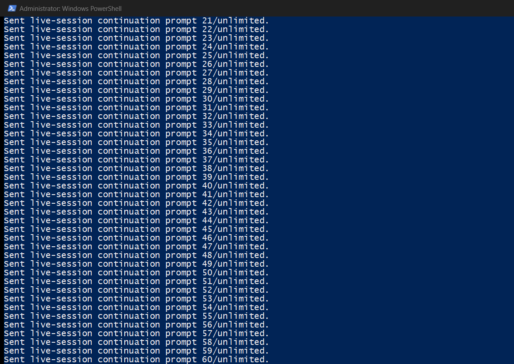

# Codex Continuum

Universal live-session continuation for Codex on Windows.

Codex Continuum watches one live Codex PowerShell window for live work signals:
the bottom `Working` text, `Waiting for background...` status text, or the Codex
spinner in the window title when the terminal hides the bottom status. When work
clears, it types `continue` and submits it in the same window. It is built for
the visible session you are already using, not for hidden backend resume or
archived transcript replay.



## Safety Model

Codex Continuum is a visible-session tool, not an autonomous background agent.
Its authority boundary is the Codex PowerShell window selected by the operator.
It does not inspect every Codex process, does not replay archived sessions, and
does not continue hidden chats. It only types into the attached live window, then
writes receipts that show what it saw and what it sent.

The default safety posture is fail-closed:

- Attach to one visible Codex PowerShell window by PID, window handle, or
  explicit project match.
- Resolve live child Codex PIDs back to the owning visible PowerShell window.
- Wait for a stable idle signal before typing `continue`.
- Pause on usage-limit or rate-limit reset warnings instead of spamming
  retries.
- Block on unrecognized interactive prompts instead of typing `continue` into a
  numbered menu.
- Stop after repeated failed or unconfirmed submit attempts.
- Stop when the attached window closes, the timeout/max-prompt limit is reached,
  Ctrl+C is pressed, or the kill-flag file appears.

Default kill flag:

```text
%USERPROFILE%\.codex\plugins\codex-continuum\data\operator\codex-live-continue.kill
```

## What It Does

- Targets any live Codex project window by `-ProjectName`, process id, or window
  handle.
- Sends input only to the selected live window.
- Types `continue`, submits it, and confirms Codex returns to active work by
  bottom status text or title spinner.
- Sends once on startup idle, so attaching after Codex has already finished
  still continues the session after a stable idle delay.
- Falls back across multiple submit keys if one Enter path types but does not
  submit.
- Retries foreground activation before typing, then keeps watching if Windows
  blocks one focus handoff.
- Pauses instead of continuing if Codex shows a usage-limit or rate-limit reset
  warning, then resumes after the reset time it can parse.
- Resyncs the live window when the same working snapshot stays unchanged past
  `-StuckWorkingSeconds`, and records the resync in receipts.
- Can opt in to selecting choice `1` on numbered Codex approval prompts, or
  choice `2` when the prompt says not to ask again, with an approval-choice
  receipt for audit. Approval detection scans the visible full-window tail only
  while Codex is not working.
- Fails closed on visible interactive prompts: if an approval-style prompt is
  suspected but not selected, Continuum writes an `interactive_prompt_blocked`
  receipt and does not type `continue` into the menu.
- Stops after repeated failed or unconfirmed submit attempts, configurable with
  `-MaxFailedSubmitAttempts`.
- Stops when a kill-flag file exists, configurable with `-KillFlagPath`.
- Writes JSONL receipts for attach, status, prompt, and stop events.
- Provides `start`, `stop`, `status`, and `update` commands from one entrypoint.
- Runs until Ctrl+C by default.

## Quick Start

Start Continuum. It lists live Codex PowerShell windows, prompts for the target
PID, prompts for the session/thread id, then begins after you submit both
values:

```powershell
powershell -NoProfile -ExecutionPolicy Bypass -File "$env:USERPROFILE\.codex\plugins\codex-continuum\codex-continuum.ps1" start
```

List live Codex windows without starting:

```powershell
powershell -NoProfile -ExecutionPolicy Bypass -File "$env:USERPROFILE\.codex\plugins\codex-continuum\codex-continuum.ps1" -ListCandidates
```

Scripted starts can still pass the target and session id up front:

```powershell
powershell -NoProfile -ExecutionPolicy Bypass -File "$env:USERPROFILE\.codex\plugins\codex-continuum\codex-continuum.ps1" start -TargetProcessId <pid> -SessionId "<session-id>"
```

Use the guarded approval-safe run when Continuum should handle Codex numbered
permission menus and avoid startup idle prompts:

```powershell
powershell -NoProfile -ExecutionPolicy Bypass -File "$env:USERPROFILE\.codex\plugins\codex-continuum\codex-continuum.ps1" start -TargetProcessId <visible-pwsh-pid> -SessionId "<session-id>" -StatusPattern '(?!)' -StableClearMilliseconds 5000 -AutoSelectApprovalChoice -ApprovalChoice 1 -DoNotAskAgainApprovalChoice 2 -RequireObservedWorkingBeforeFirstPrompt
```

`-TargetProcessId` should be the visible Codex PowerShell PID. If you provide a
live child Codex PID, the launcher resolves it to the owning visible PowerShell
window. If Windows cannot see that PID, choose a PID from `-ListCandidates`.

Use `-NonInteractive` only for automation that intentionally wants the old
argument-only behavior:

```powershell
powershell -NoProfile -ExecutionPolicy Bypass -File "$env:USERPROFILE\.codex\plugins\codex-continuum\codex-continuum.ps1" start -ProjectName "<ProjectName>" -SessionId "<session-id>" -NonInteractive
```

Probe before running:

```powershell
powershell -NoProfile -ExecutionPolicy Bypass -File "$env:USERPROFILE\.codex\plugins\codex-continuum\codex-continuum.ps1" -ProjectName "<ProjectName>" -ProbeOnly -VerboseStatusText
```

Stop it with Ctrl+C in the watcher PowerShell window.

If you do not want the startup idle kick, add
`-RequireObservedWorkingBeforeFirstPrompt`.

Continuum waits five continuous seconds after work clears before typing
`continue`; tune with `-StableClearMilliseconds` only when status detection is
reliably stable.

Stop or pause behavior:

- `usage_paused`: actionable usage-limit, rate-limit, or reset warning
  detected; sends pause until the parsed reset time or fallback pause expires.
- `interactive_prompt_blocked`: visible approval/menu prompt was detected but
  not safely selected; sends pause until the prompt clears.
- `resynced`: attached working snapshot looked stuck and Continuum refreshed
  the target handle before deciding whether it was still working.
- `window_closed`: attached live window no longer exists; watcher stops.
- `focus_lost`: watcher stops only when `-ExitOnFocusLoss` is set.
- `repeated_failed_submit`: failed or unconfirmed submits reached
  `-MaxFailedSubmitAttempts`.
- `kill_flag`: `-KillFlagPath` exists.
- `timeout` / `max_prompts`: bounded run limit reached.

Check watcher health:

```powershell
powershell -NoProfile -ExecutionPolicy Bypass -File "$env:USERPROFILE\.codex\plugins\codex-continuum\codex-continuum.ps1" status
```

If an actionable usage warning appears, Continuum records a `usage_paused`
receipt and stops sending `continue` until the reset time. Generic transcript or
repository text that only mentions quota does not pause the watcher. If the
warning does not include a time, the default pause is one hour. Override with
`-UsagePauseFallbackSeconds`, or disable the guard with
`-DisableUsageLimitPause`.

If the same working snapshot does not change for 30 minutes, Continuum writes a
`resynced` receipt and re-resolves the target from the configured PID or window
handle. If the stale signal is only bottom `Working` text and the title is no
longer actively working, Continuum treats that stale text as idle, then still
runs the full-window approval/prompt guard before sending `continue`. Tune with
`-StuckWorkingSeconds`; set it to `0` to disable automatic stuck-working resync.

Auto-select approval prompts only when you intentionally want Continuum to pick
choice `1` on numbered Codex approval menus, or choice `2` when the prompt says
not to ask again:

```powershell
powershell -NoProfile -ExecutionPolicy Bypass -File "$env:USERPROFILE\.codex\plugins\codex-continuum\codex-continuum.ps1" start -TargetProcessId <pid> -SessionId "<session-id>" -AutoSelectApprovalChoice
```

Stop running Continuum watchers:

```powershell
powershell -NoProfile -ExecutionPolicy Bypass -File "$env:USERPROFILE\.codex\plugins\codex-continuum\codex-continuum.ps1" stop
```

Update an installed release build:

```powershell
powershell -NoProfile -ExecutionPolicy Bypass -File "$env:USERPROFILE\.codex\plugins\codex-continuum\codex-continuum.ps1" update
```

## Install

From the latest GitHub release:

```powershell
$version = "0.2.3"
$zip = Join-Path $env:TEMP "codex-continuum-plugin-v$version.zip"
Invoke-WebRequest -Uri "https://github.com/Ap3pp3rs94/codex-continuum/releases/download/v$version/codex-continuum-plugin-v$version.zip" -OutFile $zip
Expand-Archive -Path $zip -DestinationPath "$env:USERPROFILE\.codex\plugins" -Force
powershell -NoProfile -ExecutionPolicy Bypass -File "$env:USERPROFILE\.codex\plugins\codex-continuum\scripts\validate.ps1"
```

From a cloned repo:

```powershell
powershell -NoProfile -ExecutionPolicy Bypass -File .\scripts\install.ps1
```

Build a distributable plugin zip:

```powershell
powershell -NoProfile -ExecutionPolicy Bypass -File .\scripts\package-plugin.ps1 -Force
```

Validate the package:

```powershell
powershell -NoProfile -ExecutionPolicy Bypass -File .\scripts\validate.ps1
```

## Receipts

Receipts default to:

```text
%USERPROFILE%\.codex\plugins\codex-continuum\data\operator\codex-live-continue.jsonl
```

Runtime receipts are ignored by git.

Use the status command to turn those receipts into a health summary:

```powershell
powershell -NoProfile -ExecutionPolicy Bypass -File "$env:USERPROFILE\.codex\plugins\codex-continuum\codex-continuum.ps1" status -Json
```

Important receipt events:

- `codex_live_continue.attached`
- `codex_live_continue.status`
- `codex_live_continue.prompt`
- `codex_live_continue.approval_choice`
- `codex_live_continue.interactive_prompt_blocked`
- `codex_live_continue.usage_paused`
- `codex_live_continue.usage_resumed`
- `codex_live_continue.stop_requested`

## Boundaries

Codex Continuum is intentionally narrow. It does not call private Codex APIs,
does not read archived sessions, and does not claim background autonomy. It
drives the same local UI a human operator would use, with receipts.

## Why Not Background Autonomy?

Background autonomy would require a different trust model: queue ownership,
policy gates, workspace mutation authority, error recovery, and audit trails
outside the visible operator session. Continuum deliberately does not take that
role. It handles one painful seam: keeping a visible Codex session moving when
the operator already chose that session and can still see the result.

That boundary keeps the tool simple to inspect. If it types, the selected
window receives keystrokes. If it pauses or stops, the receipt log explains why.
If the target window disappears or the prompt becomes ambiguous, it stops or
blocks instead of guessing.

## Francis Case Study

A later case study should document the Francis overnight continuation workflow:
100+ roadmap-governed Codex commits with visible-session continuation, receipt
checks, guarded permission prompts, and explicit stop conditions. Keep that as a
case study, not a product claim, until the exact run receipts and commit range
are published.

More detail:

- [Usage](docs/USAGE.md)
- [Design](docs/DESIGN.md)
- [Troubleshooting](docs/TROUBLESHOOTING.md)
